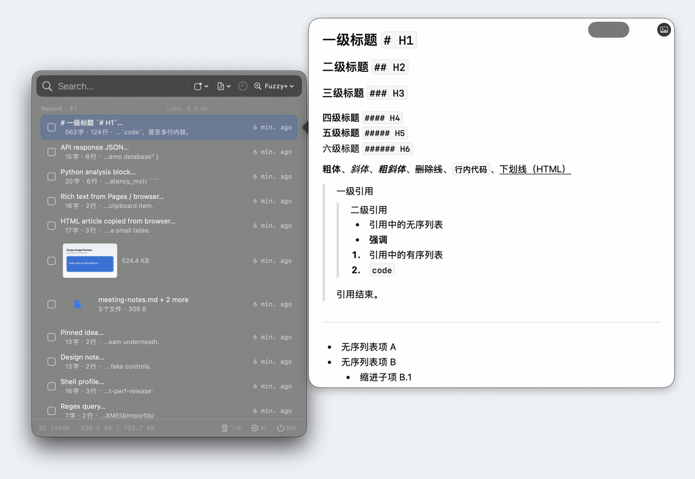

<div align="center">
  

  # Scopy

  **A native macOS clipboard manager with fast long-history search and ChatGPT-style Markdown/LaTeX preview.**

  [](#requirements)
  [](#build-from-source)
  [](#why-scopy)
  [](#installation)
  [](#license)
</div>


Scopy is a Maccy-inspired macOS clipboard manager for people who copy AI answers, research notes, code, screenshots, formatted text, and files all day. It keeps the instant native Mac workflow of a menu bar clipboard tool, then adds a richer preview and export surface for modern Markdown-heavy work.

The product screenshots in this README are captured from Scopy's real native `FloatingPanel` and hover preview with a temporary privacy-safe fixture database on a clean white-gray background. The product UI is not redrawn or approximated.

## At A Glance

| Need | Scopy answer |
| --- | --- |
| Native Mac clipboard history | SwiftUI menu bar app, global hotkey, translucent floating panel, keyboard navigation, Settings, context menus |
| Maccy-style speed with richer workflows | Small first page, explicit load-more, pinned rows, deduplication, Exact/Fuzzy/Fuzzy+/Regex search |
| AI clipboard post-processing | ChatGPT-style Markdown/LaTeX preview, 80%-200% scale, shared preview/export renderer, PNG export |
| Mixed content history | Plain text, RTF, HTML, images, files, thumbnails, external payload storage, AirDrop and Finder actions |
| Evidence-backed performance | Snapshot DB benchmarks, frontend profiles, strict concurrency tests, release validation |

## Why Scopy

- **Native Mac, restrained by default**: menu bar app, global hotkey, translucent floating panel, keyboard navigation, Settings, context menus, AirDrop, Finder reveal, and predictable Save/Cancel settings.
- **Built for long history**: text, RTF, HTML, images, and files are persisted with deduplication, inline/external storage, thumbnails, notes, and policy-controlled retention.
- **Fast recall**: Exact, Fuzzy, Fuzzy+, Regex, app filters, type filters, pinned rows, and incremental loading keep search responsive while typing.
- **AI-output workflow**: copy a ChatGPT answer, hover to inspect Markdown/LaTeX with a ChatGPT-like reading surface, tune the 80%-200% preview scale, then export PNG from the same rendered layout.
- **Preview more than text**: image previews, file previews, rich text/HTML preservation, Markdown tables, footnotes, code blocks, math, source pills, and optional pngquant compression.

## Preview




[Download the MP4 version](assets/video/scopy-markdown-scroll.mp4)

## Markdown/LaTeX Is The Differentiator

Scopy's Markdown preview/export path is the feature that makes it more than another clipboard list.

| Capability | What it means |
| --- | --- |
| ChatGPT-style reading surface | Local CommonMark/GFM rendering styled from captured ChatGPT/WACZ contracts for headings, paragraphs, lists, blockquotes, code, tables, source citations, and CJK rhythm. |
| Preview/export parity | Hover preview and PNG export share the renderer, so tables, code, math, footnotes, and source pills do not silently change between inspection and export. |
| Layout scale | Markdown hover preview supports 80%-200% scale; export launched from that preview uses the visible profile. |
| Rich syntax | Footnotes, definition lists, task lists, fenced code, syntax highlighting, safe HTML islands, inline and block math, standard tables, and wide-table scroll behavior. |
| Local-first | Renderer assets are bundled locally; image and Markdown PNG compression can use the configured pngquant path. |

## Maccy-Inspired, But Wider

Maccy is excellent when you want a minimal, keyboard-first clipboard list. Scopy keeps that baseline expectation, then deliberately targets richer workflows that show up in public clipboard-manager requests:

| Common pain point or request | Scopy design answer |
| --- | --- |
| Large custom histories can make a popup slow to prepare, especially around 10,000 items ([p0deje/Maccy#1372](https://github.com/p0deje/Maccy/issues/1372)). | Pinned rows load separately, the first recent page stays small, and load-more pages are explicit. |
| Large clippings and long previews can lag ([#1080](https://github.com/p0deje/Maccy/issues/1080), [#1095](https://github.com/p0deje/Maccy/issues/1095)). | Preview preparation, Markdown rendering, thumbnails, and export have bounded paths and focused tests. |
| Users ask for better image save/draw/share workflows ([#1331](https://github.com/p0deje/Maccy/issues/1331), [#1245](https://github.com/p0deje/Maccy/issues/1245), [#1348](https://github.com/p0deje/Maccy/issues/1348)). | Scopy stores image rows, shows thumbnails, previews images, optimizes/compresses, and sends image/file rows via AirDrop. |
| Duplicate suppression and direct reuse matter ([#1124](https://github.com/p0deje/Maccy/issues/1124), [#1306](https://github.com/p0deje/Maccy/issues/1306)). | Equivalent content is deduplicated at ingest, and keyboard-first select/copy/paste flows are part of the main panel contract. |

## Performance Evidence

Scopy's performance claims are tied to checked-in docs and repeatable commands. Current requirements target interactive search at P95 `<= 50ms` for `<= 5k` items and first-page P95 `<= 100-150ms` for `10k-100k` histories.


Representative recorded evidence:

| Evidence | Result |
| --- | ---: |
| Real snapshot DB, 6,421 items / 148.6 MB, release bench, `cmd` Fuzzy+ P95 | `0.21ms` |
| Real snapshot DB, 6,421 items / 148.6 MB, release bench, `cm` Fuzzy+ P95 | `9.81ms` |
| Historical heavy perf suite, 50k fuzzy P95 | `90.6ms` |
| Historical heavy perf suite, 75k fuzzy P95 | `124.7ms` |
| v0.7.6 frontend standard profile, real snapshot row display-model P95 | about `0.56ms` |

See [doc/current/product-spec.md](doc/current/product-spec.md), [doc/perf/baselines/perf-baseline-2026-01-27.md](doc/perf/baselines/perf-baseline-2026-01-27.md), and [doc/perf/release-profiles/](doc/perf/release-profiles/) for the evidence trail.

## Feature Map

| Area | Details |
| --- | --- |
| Native shell | Menu bar app, SwiftUI views, floating panel, global hotkey, keyboard navigation, Settings pages |
| History | Text, RTF, HTML, images, files, pins, deduplication, inline/external payload storage |
| Search | Exact, Fuzzy, Fuzzy+, Regex, app filters, type filters, grouped rich-text filters |
| Preview | Text, image, file, Markdown, LaTeX, safe HTML islands, syntax highlighting, math, footnotes, source pills |
| Export | Markdown/LaTeX to PNG, preview-scale-aware export, optional pngquant compression |
| macOS actions | Copy, paste, pin, delete, AirDrop, Open Containing Folder, file notes, image optimization |
| Operability | Makefile build/test targets, strict concurrency tests, snapshot performance gates, release metadata validation |

## Installation

### Homebrew

```bash
brew tap Suehn/scopy
brew install --cask scopy && xattr -dr com.apple.quarantine /Applications/Scopy.app
```

Upgrade:

```bash
brew upgrade --cask scopy && xattr -dr com.apple.quarantine /Applications/Scopy.app
```

The app is currently unsigned. On first launch, right-click Scopy in Applications, choose Open, then confirm.

If `Scopy.app` does not appear in `/Applications`:

```bash
brew reinstall --cask scopy --appdir=/Applications
```

### Manual Download

Download the latest `.dmg` from [GitHub Releases](https://github.com/Suehn/Scopy/releases).

## Usage

| Action | Shortcut / gesture |
| --- | --- |
| Open or close panel | `Shift` + `Command` + `C` by default, customizable |
| Search history | Start typing in the panel |
| Navigate | Up / Down |
| Select and paste | Enter |
| Clear search or close | Esc |
| Delete selected item | Option + Delete |
| Open Settings | Command + Comma |
| Context actions | Right-click a row |
| Markdown/LaTeX export | Hover preview, adjust scale if needed, export PNG |

## Requirements

- macOS 14.0 or later
- Swift 5.9
- Xcode 16.0 or later for local development
- Homebrew if you want `make setup` to install missing developer tools such as `xcodegen`

## Build From Source

```bash
make build
make test-unit
make test-strict
```

Release build:

```bash
make release
```

Performance validation uses a realistic clipboard DB snapshot and writes evidence to `logs/`:

```bash
make snapshot-perf-db
make test-snapshot-perf-release
make perf-frontend-profile
```

## Architecture

```text
Scopy app shell
  AppDelegate, menu bar, floating panel, SwiftUI views, settings
        |
        v
ClipboardServiceProtocol
        |
        v
ScopyKit backend
  ClipboardMonitor -> ClipboardService -> StorageService -> SearchEngineImpl
        |
        v
SQLite / FTS5 / external payload files / thumbnails
```

Important boundaries:

- Views do not directly read database or external storage paths.
- Clipboard ingest, deduplication, cleanup, and safe file handling belong behind backend protocols.
- Preview/export work uses shared renderer paths so visual fixes apply to both hover preview and PNG output.
- Heavy I/O, hashing, indexing, cleanup, thumbnail, preview, and export work should stay off the main thread.

## Documentation

- [Current product spec](doc/current/product-spec.md)
- [Development guide](doc/current/development-guide.md)
- [Architecture](doc/current/architecture.md)
- [Release docs](doc/releases/README.md)
- [Changelog](doc/releases/CHANGELOG.md)
- [Performance evidence](doc/perf/README.md)

## License

MIT License.
