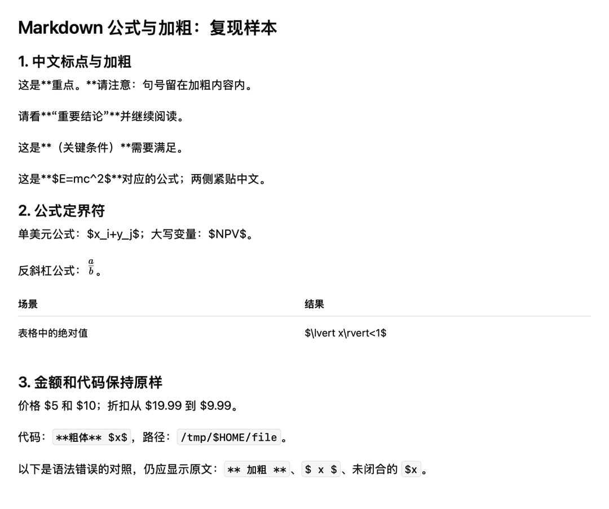
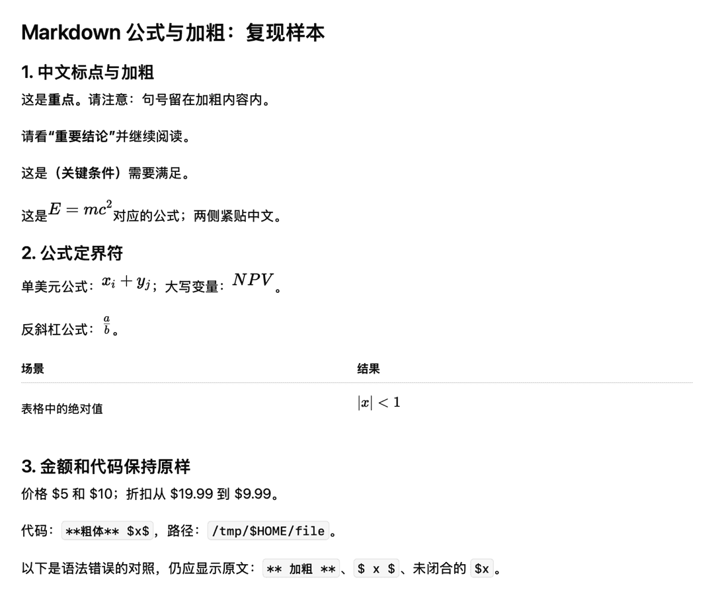

# Markdown 公式和加粗：复现与修复

基线 `e1d7846`。用户没有提供原始失败文本，本次从规范/上游问题和当前渲染器构造最小复现；不能断言已覆盖用户过去看到的每一次失败。用户随后明确要求支持 `$...$`，并验证金额不会被误解析。

## 搜索与归因

| 问题 | 最小复现 | 原因与裁决 |
| --- | --- | --- |
| 中文标点使加粗失效 | `这是**重点。**请注意`、`请看**“重要结论”**并继续` | CommonMark delimiter flanking 按标点/空白判定开闭；中文通常不插入西文空格。[规范](https://spec.commonmark.org/0.31.2/#emphasis-and-strong-emphasis)和[上游 CJK 讨论](https://talk.commonmark.org/t/emphasis-and-east-asian-text/2491)描述了这个经典问题 |
| 加粗包裹公式露星号 | `这是**\(E=mc^2\)**结论`、`这是**$$E=mc^2$$**结论` | 公式自身可渲染，外部强调定界符遇到中文和数学标点却不能配对；与上一个问题同源 |
| `$...$` 一直显示源码 | `$x_i+y_j$` | Scopy 原契约显式关闭单美元解析，并非 KaTeX 随机失败。用户此次要求改变该规则；[remark-math 官方选项](https://github.com/remarkjs/remark-math/tree/main/packages/remark-math#options)也明确提示单美元与金额的冲突 |
| 中文公式可能进不了预览 | `公式$x$之后` | Swift `MarkdownDetector` 把闭合 `$` 后的中文当作标识符延续；同步修正 CJK 边界，不让 JS 能解析的内容被入口漏掉 |
| 表格中公式破损 | 表格单元格中的 `$|x|<1$` | 未转义 `|` 是 GFM 分栏符，公式先被拆开；应写 `$\lvert x\rvert<1$`，不靠猜测修改表格语义 |
| 空格、转义、代码、不闭合 | `** 加粗 **`、`$ x $`、代码中的 `$x$`、未闭合 `$x` | 保留为字面量；这些不应通过全局替换被强行解析 |

## 最终实现

- 引入 [remark-cjk-friendly](https://github.com/tats-u/markdown-cjk-friendly) 2.3.1 的 `parseOnly` 入口，加入既有 remark 链路。没有插零宽字符、改源码空格、正则生成 `<strong>` 或增加另一套渲染器。
- `remarkScopyMath` 使用既有 upstream math tokenizer 和 AST 扩展，只验证单美元定界符边界；双美元、反斜杠及 math fence 继续走同一实现。规则借鉴 [Pandoc `tex_math_dollars`](https://pandoc.org/MANUAL.html#extension-tex_math_dollars)，另加保守的 ASCII 标识符和路径边界。
- `$...$` 必须同一行、内容非空、定界符内侧无空白。开头不能紧跟 ASCII 字母/数字/下划线、斜杠、反斜杠、点或 `$`；结尾不能紧接 ASCII 字母/数字/下划线、斜杠、反斜杠或 `$`。中文邻接允许。
- `$5 and $10`、`US$5 to US$10`、`$19.99–$29.99`、shell 变量、代码、路径、链接目标的回归保持字面量；前面的金额不吞掉后面的合法公式。链接标签可以包含公式。
- 单独明确配对的 `$5$` 按数学解析。如果作者确实要显示成对美元字符，应使用 `\$` 或代码。相同字符可以有不同写作意图，因此这里是明确的语法规则，不是保证识别任意金额表达式的语义分类器。
- Swift 原生入口检测同步支持 CJK 邻接；render cache version 从 v7 升至 v8。canonical 契约标注为此次用户要求的 Scopy 扩展，未冒充历史 ChatGPT 归档行为。
- IIFE、SHA 和 asset manifest 一起重建；KaTeX 版本/60 个字体保持匹配。新增解析支持令 IIFE 从 736,392 增至 752,134 字节（+15,742 字节），没有运行时性能提升声明。

## 复现材料与视觉结果

同一份 [Markdown fixture](../../../ScopyTests/Fixtures/markdown_delimiter_repro.md) 被 Node 测试、Swift 文档入口测试和实际应用 PNG 导出共同使用。未使用图片生成器或截图修改来制造结果。

| 基线实际应用输出 | 修复后实际应用输出 |
| --- | --- |
|  |  |

基线 PNG 1080×903，修复后 1080×930。目视检查确认中文强强调不再露出星号，单美元的上下标/分式/大写变量及表格绝对值完整，金额、代码、尾部对照均保留。

另外，既有不可变 `chatgpt_rich_copy_sample.md` 本来就包含三处单美元公式。修复后这三处均严格渲染成功，商品价格 `$79.99`、`$209.99`、`$398.00` 仍为原文；fixture 长度和 SHA 断言继续通过。47 KB 长文 stress fixture 的 132 个原有公式回归也通过。

## 验证

环境：Apple M3 Pro，macOS 15.7.3，Xcode 26.1.1。未改变 Swift/最低系统版本或 release metadata。

- `npm test`：147/147 通过，包含新定界符矩阵、原有安全 HTML/富媒体/长文契约。
- `npm run build`、`npm run verify:assets`、最终 `make build`：通过。
- Swift 定向：29/29 通过。
- 普通与严格并发 build-for-testing 产物分别直接运行 XCTest：各 830 项，4 skipped，0 failures；选择范围与 `make test-unit` / `make test-strict` 相同。沿用本会话已确认的 IDE session 初始化阻塞替代执行方式，不把 IDE 调度路径记为通过。原有并发警告不属于本次修复。
- `make docs-validate`、`make release-validate`、`git diff --check`：通过。
- `scopy-export-png` 调用基线/候选构建的实际 Scopy 二进制，均返回 `PNG_READY` 并完成图片检查；使用 `--no-quit-existing`，未替换 `/Applications/Scopy.app`。

可单独复查解析矩阵：`cd Tools/MarkdownRenderer && node --test test/delimiters.test.js`。完整执行日志保留在主工作区 `logs/markdown-delimiters-20260905/`。
