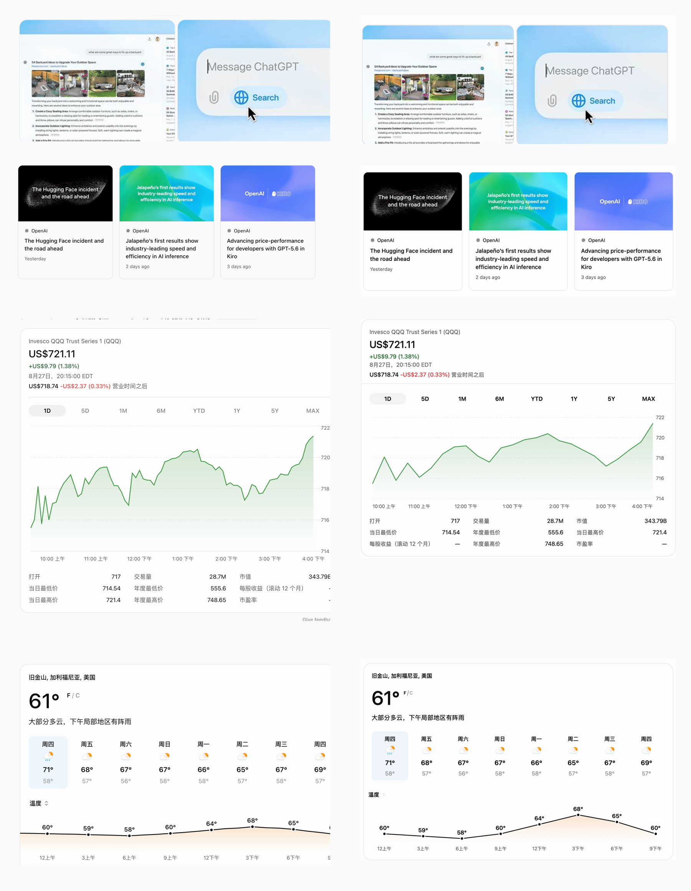

# Scopy ChatGPT/Codex Rich Rendering Design QA

Date: 2026-08-28

## Visual Target And Evidence

The accepted target is the supplied ChatGPT/Codex light-theme state: ordinary outbound links, Codex file links, compact grouped citations, search-image groups, three-column news cards, finance, weather, and currency. Promotions, merchant cards, and maps are outside this release.

The WACZ establishes captured runtime paths, resources, saved text, and selected structured fields. The supplied captures and recorded live Edge inspection ground the current visual layout. Because the archive contains no hydrated completed-answer DOM or computed-style snapshot, this review does not claim WACZ-only pixel proof, dark-mode parity, or a computed body font.

## Same-Input Comparison

The left column contains supplied reference captures. The right column contains the Scopy real-application export at 2160 px.

Full Scopy export: [scopy-chatgpt-rich-v2.png](../../../assets/screenshots/scopy-chatgpt-rich-v2.png) (2160 x 12762).

## Findings And Resolutions

### P0

- None remaining. All supported surfaces use the single production Markdown chain; preview/export share the validated v2 DOM, CSS, local assets, and runtime.

### P1

- Replaced the boxed outbound symbol with the official Phosphor outbound-link path. Absolute local paths retain file-kind icons and a separate native-open policy.
- Replaced fragile chart gradient export behavior with deterministic local fills while retaining line and data-point interaction layers.
- Expanded the structured fixture to the measured eight finance ranges and eight forecast days without fetching or inventing new live data.
- Replaced raw news domains/timestamps with the captured publisher identity and supplied relative-date labels.
- Removed hidden Markdown premeasurement and added a preview owner lease, closing the observed first-hover blank state.

### P2

- Added stable finance ticks matching the reference scale instead of exposing raw data extrema.
- Uses degree-only weather values with the dedicated F/C control.
- Matches the supplied two-up search-image order.
- Deduplicates identical preview updates and retries late internal-scroll-view configuration, closing the identified scroll flicker path.

## Interaction And Stability Checks

- Currency: editable in either direction using a frozen rate, with validation, grouping, and export freeze.
- Weather: F/C, eight day buttons, chart probes, ARIA state, and keyboard operation.
- Finance: eight range buttons, pre-rendered panels, chart probes, stable ticks, and export freeze.
- Images: local two-up group, lightbox navigation, Escape, focus restoration, and no remote fetch.
- Sources: grouped source popup with keyboard focus and both-edge viewport positioning.
- Links: validated HTTP(S) and strict Codex absolute-file activation only after an explicit preview click; export remains inert.
- Lifecycle: a stale owner cannot detach or cancel the current owner; 100 identical updates produce one bridge setup, one applied scroll configuration, and one navigation; late WebKit scroll-view creation retries successfully.

## Verification

- Node renderer/runtime: 77 tests, 0 failures; production bundle built.
- Swift unit: 749 executed, 2 skipped, 0 failures.
- Swift strict concurrency: 749 executed, 2 skipped, 0 failures.
- Real Scopy exports: user stress fixture 2160 x 141619; visible-text fixture 1080 x 8653; top, middle, and tail inspected.
- The optional include-hover UI harness timed out while enabling macOS automation mode before the scenario began. It is environment-blocked and is not counted as a pass.

final result: passed
